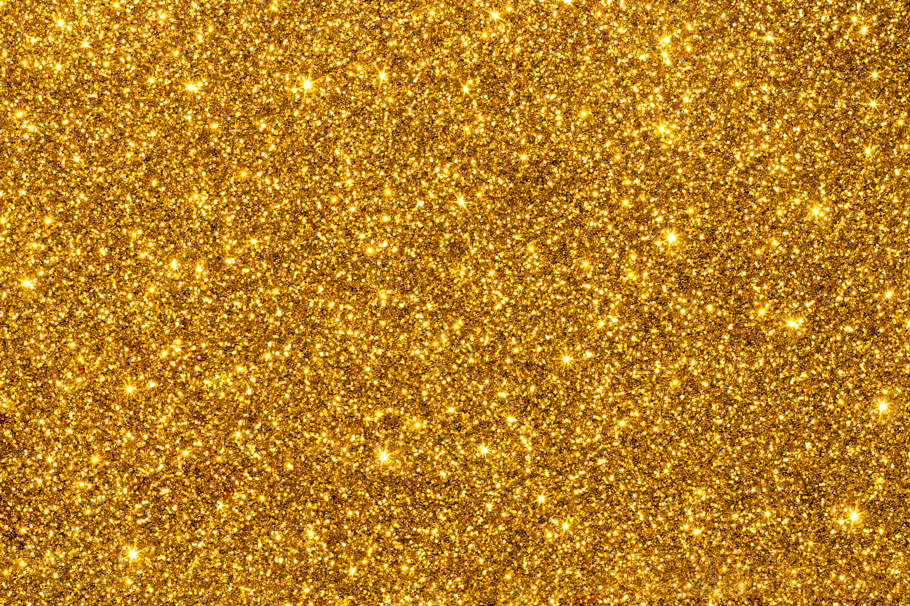

# Kruszex

A website about precious metals.

## Installation

+   Download Git from https://git-scm.com and install it
+   Download XAMPP from https://www.apachefriends.org/download.html and install it
+   Change your directory to "C:/xampp/htdocs"
+   Open GitBash and run: git clone https://github.com/KubaM-97/Kruszex.git
+   Open XAMPP and run: Apache
+   Set your URL to http://localhost/Kruszex/dist/

## Technologies
+   AJAX
+   XAMPP
+   Bootstrap

## Customize configuration
See Configuration Reference.

## License
[MIT](https://choosealicense.com/licenses/mit/)
